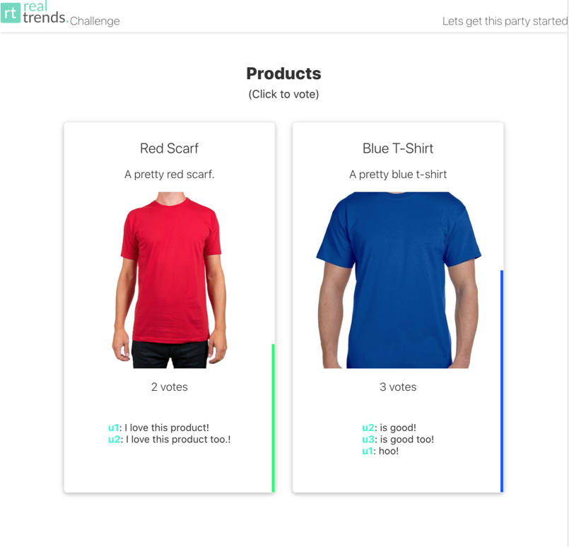

 Challenge

## Why i did this challenge?
- ✅  websocket flow testing
- ✅  react js + node interaction 





# RealTrends challenge
Se debe crear una aplicación de votación realtime.
- Must create a realtime voting app

## API
- ✅  Debe exponer un servidor de websocket al que se pueda subscribir.
- - Must expose a websocket server able to be subscribed to.
- ✅  Debe emitir eventos cuando haya votos nuevos.
- - Must emit event on every new vote.

## Cliente
- ✅  Debe haber al menos dos productos sobre los cuales se pueda votar.
- - Must be at least 2 products for vote.
- ✅  Se debe mostrar un indicador del porcentaje de votos de cada producto.
- - Must be an indicator of votes % on every product.
- ✅  Se debe poder ver quienes fueron los votantes y sus respectivas valoraciónes.
- - Must show who has voted, with respectives reviews.
- ✅  Cada usuario puede votar una vez, si vota más de una, el voto se transfiere.
- - Every user can vote only once per product, if vote again it must rebalance vote countings.

## Definiciones técnicas
- ✅  El código de la aplicación debe estar subida a un repositorio de público acceso.
- - app code must be in a public repo.

## Puntos extra
- ✖️ : El usuario puede seleccionar los productos desde el cliente viendo un modal con productos de Mercado Libre.
- ✖️ : La votación se puede pausar, reanudar y reiniciar desde el cliente.

## Correr el proyecto
```bash
## Instalar las dependencias del proyecto
npm install

## Instalar las dependencias de los paquetes
npm run bootstrap

## Correr los paquetes
npm run dev
```